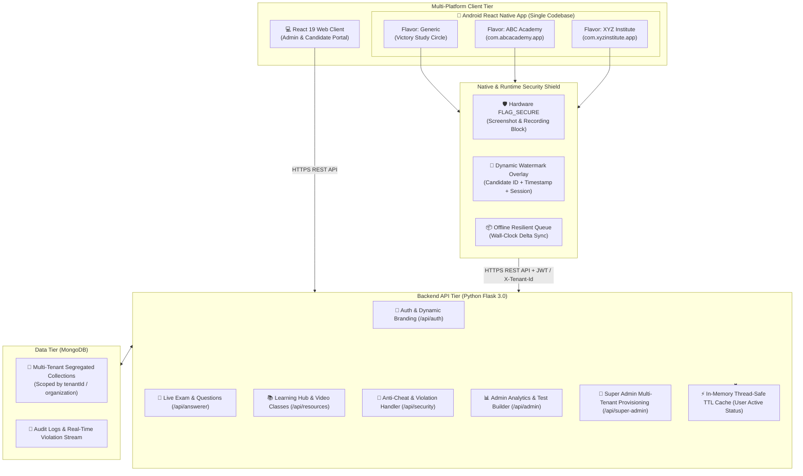

# 🎓 Victory Study Circle - Exam & Assessment Portal

An enterprise-grade, white-label multi-tenant Online Examination, Learning Management, Candidate Assessment, and **Production Android Mobile Platform**. Built with a high-performance **React 19 Web** client, a **React Native Android Mobile Application** supporting organization-specific Play Store builds from a single codebase, and a robust, low-latency **Python Flask + MongoDB** backend.


---

## 🏛️ System Architecture



---

## 🌟 Key Capabilities & Features

### 1. 📱 Production Android App & White-Label Multi-Tenant Platform
- **Unified React Native Codebase (`mobile/`)**: Multiple institutional mobile apps (e.g., *Victory Study Circle*, *ABC Academy*, *XYZ Institute*) built from one unified source code repository without duplicating screens or logic.
- **Android Gradle Product Flavors & Independent Release Signing**: Distinct `applicationId`, package names, launcher icons, and splash screens configured via Gradle product flavors (`generic`, `abc`, `xyz`).
- **Dynamic Runtime Branding**: Generic multi-tenant application automatically queries `GET /api/auth/tenant-branding` on login to apply organization logos, colors, and feature flags.
- **Hardware-Level `FLAG_SECURE` Protection**: Native Android window security blocks screenshots, screen recording apps, and multitasking preview captures during examinations and document reviews.
- **TCS iON Examination Engine**: Full mobile-first test interface featuring live countdown timers, section-wise tabs, MCQ/MSQ/ordering questions, rich data tables, bottom-sheet question palette with color-coded status badges, and hardware Back button interception.
- **Offline Resiliency & Autosave**: Local answer buffering with background wall-clock delta calculation upon resume and automatic synchronization upon reconnection.

### 2. 🏢 Multi-Tenant SaaS & Super Admin Control
- **Tenant Isolation**: Complete data segregation by `tenantId` across all collections (exams, candidates, results, materials, logs).
- **Super Admin Dashboard (`/super-admin`)**: Provision organizations, create new tenant portals, monitor global user quotas, and view cross-tenant system metrics.
- **Dynamic Organization Branding**: Custom tenant names, logos, color themes, and dedicated portals for institutional partners.

### 3. 🛡️ Advanced Anti-Cheat & Screen Protection
- **Dynamic Canvas & Native Watermarking**: High-visibility, tamper-resistant watermark rendering live candidate ID, session code, organization name, and real-time timestamps to deter unauthorized leaks.
- **Screenshot & Capture Interception**: Detects `PrintScreen`, `Alt+PrintScreen`, `Win+Shift+S`, `Cmd+Shift+3/4/5/6`, `Ctrl+P`, `beforeprint`, and OS Snipping Tool / window blurs.
- **Automatic Account Suspension**: Configurable violation threshold with automatic account locking, session termination, and audit logging.
- **Screen Recording & Tab Switching Guards**: Detects window blur, tab switching, and unauthorized media stream sharing.

### 4. ⚡ High-Throughput Engine & Low-Server-Load Architecture
- **Thread-Safe In-Memory TTL Cache**: In-memory user active-status caching in [backend/utils/cache.py](file:///d:/Adhi/Shine/Shine-Exam/backend/utils/cache.py) eliminates >95% of repetitive database lookups during concurrent candidate exams.
- **Optimized MongoDB Connection Pooling**: Tuned connection pool (`maxPoolSize=50`, `minPoolSize=5`, `maxIdleTimeMS=45000`, `retryWrites=True`).
- **Auto Background Indexing**: Core fields (`userId`, `naxUnid`, `role`, `status`, `tenantId`, `examId`) are indexed in the background for sub-millisecond query resolution.
- **In-Database Aggregation Pipelines**: Analytics and pass rates compute natively in MongoDB via `$group` pipelines with zero Python memory overhead.

### 5. 📝 Multi-Modal Document Question Parser & Test Builder
- **Universal File Ingestion**: Ingests `.pdf`, `.docx`, `.pptx`, `.xlsx`, `.csv`, `.txt`, and images.
- **Multimodal AI Pipeline**: PyMuPDF page rendering, OCR fallback via Tesseract/OpenCV, visual chart/table detection, and automated answer key mapping.
- **Interactive Question Editor**: Real-time inline editing, section management, negative marking rules, cutoffs, and question grouping for comprehension passages.

### 6. 🎥 Video Lectures, Study Materials & Announcements
- **Video Class Streaming**: Dedicated desktop and mobile-responsive video player for candidate course streams.
- **Document Management**: Distribute syllabus PDFs, formula sheets, and study notes with access control.
- **Broadcast Announcements**: Visual notice board with date-based scheduling and priority alerts.

---

## 🛠️ Technology Stack

| Layer | Technologies Used |
|---|---|
| **Mobile App (Android)** | React Native 0.73, TypeScript 5, React Navigation v6, Axios, Android Gradle Product Flavors, Native `FLAG_SECURE` Module |
| **Frontend (Web)** | React 19, TypeScript 5, React Router DOM v6, Vanilla CSS (Design Tokens, Glassmorphism, Micro-animations) |
| **Backend** | Python 3.11, Flask 3.0, Flask-CORS, PyMongo, Gunicorn, Werkzeug |
| **Database** | MongoDB (NoSQL Database with Connection Pooling & Background Indexes) |
| **Security & Anti-Cheat** | Native Android `FLAG_SECURE`, Dynamic Watermarking, Session ID Tokens, Rate Limiting, Audit Logs |
| **Performance** | Thread-Safe In-Memory TTL Caching, MongoDB `$group` Aggregations, Client Throttling, In-Flight Request Deduplication |
| **Document Processing** | PyMuPDF (fitz), pdfplumber, pypdf, python-docx, openpyxl, Pillow, pytesseract, OpenCV |
| **Containerization** | Docker, Docker Compose |

---

## 📁 Repository Structure

```text
Victory-Study-Circle-Exam/
├── backend/                        # Python Flask Backend & MongoDB API
│   ├── app.py                      # Flask Application Entry Point & Security Firewall
│   ├── config/
│   │   ├── db.py                   # MongoDB Connection Pool & Auto Indexing
│   │   └── settings.py             # Environment Configuration & Security Settings
│   ├── routes/
│   │   ├── admin_dashboard.py      # Aggregated Metrics & Dashboard APIs
│   │   ├── admin_exams.py          # Exam Management & Publishing APIs
│   │   ├── admin_results.py        # Assessment Analytics & Candidate Scores
│   │   ├── admin_security_controls.py # Anti-Cheat Policy & Security Controls
│   │   ├── admin_users.py          # Candidate Management & Credential Reset
│   │   ├── admin_videos.py         # Video Class Management APIs
│   │   ├── admin_violations.py     # Violation Logs & Unblock Management
│   │   ├── answerer.py             # Live Exam Execution & Candidate APIs
│   │   ├── auth_routes.py          # Authentication & Dynamic Branding APIs
│   │   ├── exam_categories.py      # Category & Subcategory Taxonomy
│   │   ├── learning_resources.py   # Documents & Announcements APIs
│   │   ├── security_routes.py      # Real-time Violation Interception & Sessions
│   │   └── super_admin.py          # Multi-Tenant Provisioning & Super Admin APIs
│   ├── services/
│   │   ├── multimodal_parser.py    # Universal Document Ingestion & Question Extractor
│   │   ├── visual_extractor.py     # OCR & Visual Table/Chart Extractor
│   │   └── scoring.py              # Candidate Assessment Evaluation Engine
│   ├── utils/
│   │   ├── cache.py                # Thread-Safe In-Memory TTL Cache
│   │   ├── security.py             # Rate Limiting, RBAC & Security Headers
│   │   └── tenant.py               # Tenant Scoping & Branding Utilities
│   └── requirements.txt            # Python Dependencies
├── frontend/                       # React 19 Web Client
│   ├── src/
│   │   ├── components/             # Admin, Answerer, Test Builder & Exam Interfaces
│   │   ├── context/                # Multi-Tenant Context Provider
│   │   ├── hooks/                  # Inactivity Logout & Security Hooks
│   │   ├── security/               # Canvas Watermark & Screen Protection
│   │   └── services/api.ts         # Centralized Fetch Client
│   └── package.json
├── mobile/                         # React Native Android Mobile Application
│   ├── android/                    # Android Native Project (Gradle Flavors, SDK 34, FLAG_SECURE)
│   │   ├── app/
│   │   │   ├── build.gradle        # Product Flavors (generic, abc, xyz) & Signing Configs
│   │   │   ├── proguard-rules.pro  # R8/ProGuard Rules for Play Store Release
│   │   │   └── src/main/java/com/victoryexam/app/
│   │   │       ├── ScreenSecurityModule.java  # Native FLAG_SECURE Bridge
│   │   │       └── ScreenSecurityPackage.java # React Package Registration
│   ├── brands/                     # Organization Brand Configurations
│   │   ├── generic.json            # Default Victory Study Circle Configuration
│   │   ├── abc_academy.json        # ABC Academy White-Label Configuration
│   │   └── xyz_institute.json      # XYZ Institute White-Label Configuration
│   ├── src/
│   │   ├── api/                    # Axios API Client & Domain Modules
│   │   ├── components/             # Reusable UI & TCS iON Exam Engine Components
│   │   ├── context/                # Auth, Tenant, and Security Context Providers
│   │   ├── hooks/                  # Exam Timer, Inactivity Logout, Screen Protection
│   │   ├── navigation/             # App, Auth, Student, and Admin Navigation Stacks
│   │   ├── screens/                # Auth, Live Exam, Student Hub, Admin & Super Admin Screens
│   │   ├── security/               # Dynamic Watermark & Native Screen Capture Shields
│   │   ├── theme/                  # Colors, Typography, and TCS iON Palette
│   │   └── utils/                  # Partitioned Multi-Tenant Storage & Offline Queue
│   ├── PLAY_STORE_DEPLOYMENT_GUIDE.md # Production Release & Play Console Guide
│   └── package.json
├── docker-compose.yaml             # Full Stack Docker Compose Configuration
└── README.md
```

---

## 📡 REST API Reference

| Endpoint | Method | Role / Auth | Description |
|---|---|---|---|
| `/api/auth/login` | `POST` | Public | User authentication; returns JWT token, user profile, and `tenantId` |
| `/api/auth/me` | `GET` | Authenticated | Fetches current user profile and session verification |
| `/api/auth/tenant-branding` | `GET` | Authenticated | Returns organization brand assets (logo, colors, name, features) |
| `/api/answerer/exams` | `GET` | Student | Lists assigned/published examinations for the authenticated student |
| `/api/answerer/exams/<id>` | `GET` | Student | Fetches test metadata, duration, instructions, and section list |
| `/api/answerer/exams/<id>/start` | `POST` | Student | Starts or resumes an exam attempt; returns question paper |
| `/api/answerer/attempts/<id>/save` | `PUT` | Student | Autosaves answer progress and status markers |
| `/api/answerer/attempts/<id>/submit`| `POST` | Student | Submits completed examination for auto-grading |
| `/api/answerer/results` | `GET` | Student | Retrieves historical test results and score breakdown |
| `/api/answerer/results/<id>` | `GET` | Student | Detailed performance analysis, accuracy, and solution key |
| `/api/learning/resources` | `GET` | Student | Lists study materials and downloadable syllabus documents |
| `/api/learning/announcements` | `GET` | Student | Fetches published institutional notices and broadcast alerts |
| `/api/admin/videos` | `GET` | Student / Admin | Fetches video lecture library |
| `/api/security/session` | `POST` | Authenticated | Creates a secure session token with device fingerprinting |
| `/api/security/violation` | `POST` | Authenticated | Reports anti-cheat violations (screenshot, blur, devtools) |
| `/api/admin/dashboard` | `GET` | Admin / Super | Overview metrics: active tests, total candidates, recent submissions |
| `/api/admin/exams` | `GET`, `POST` | Admin | Manages exam creation, scheduling, and question authoring |
| `/api/admin/results` | `GET` | Admin | Comprehensive student assessment results and exportable reports |
| `/api/admin/violations` | `GET` | Admin | Real-time anti-cheat violation monitor and account unlock controls |
| `/api/super-admin/tenants` | `GET`, `POST` | Super Admin | Multi-tenant organization provisioning and quota management |

---

## 🚀 Getting Started

### Prerequisites
- **Node.js**: v18.x or higher
- **Python**: v3.11 or higher
- **MongoDB**: Local MongoDB instance running on `localhost:27017` or MongoDB Atlas URI
- **Android Studio & SDK**: Android SDK 34 with Build Tools 34.0.0 (for mobile development)

---

### 1. Backend Setup
```bash
cd backend
python -m venv venv

# On Windows (PowerShell):
.\venv\Scripts\Activate.ps1
# On Linux/macOS:
source venv/bin/activate

# Install dependencies
pip install -r requirements.txt

# Start the Flask API server
python app.py
```
*Backend API service runs at `http://localhost:5000`*

---

### 2. React Web Frontend Setup
```bash
cd frontend
npm install
npm start
```
*Web application runs at `http://localhost:3000`*

---

### 3. Android Mobile Application Setup & Builds

```bash
cd mobile
npm install
```

#### Run on Android Device / Emulator (Development):
```bash
# Start Metro bundler
npm start

# In another terminal: run the Generic flavor on connected device/emulator
npm run android
```

> **Note for Android Emulator:** The app connects to the local backend using `http://10.0.2.2:5000/api`. For physical devices, set `API_BASE_URL` in `mobile/src/api/client.ts` to your machine's local Wi-Fi IP (e.g. `http://192.168.1.100:5000/api`).

#### Build Android App Bundles (.aab) for Google Play Store:
```bash
# 1. Build Generic Victory Study Circle Production Bundle (.aab)
npm run bundle:generic:release

# 2. Build ABC Academy Branded Production Bundle (.aab)
npm run bundle:abc:release

# 3. Build XYZ Institute Branded Production Bundle (.aab)
npm run bundle:xyz:release
```
*Generated `.aab` bundles are output to: `mobile/android/app/build/outputs/bundle/<flavor>Release/app-<flavor>-release.aab`.*

For complete Google Play Store publication steps, signing keystore setup, and Data Safety declarations, see [`mobile/PLAY_STORE_DEPLOYMENT_GUIDE.md`](file:///d:/Adhi/Shine/Shine-Exam/mobile/PLAY_STORE_DEPLOYMENT_GUIDE.md).

---

## 🏢 Onboarding Future White-Label Organizations

To add a new branded organization without modifying application screens:

1. **Backend Tenant Provisioning**: Create the organization record in MongoDB with a unique `tenantId` (e.g. `"apex-institute"`).
2. **Brand Configuration File**: Create `mobile/brands/apex_institute.json`:
   ```json
   {
     "tenantId": "apex-institute",
     "appName": "Apex Institute Exam",
     "applicationId": "com.apexinstitute.app",
     "theme": {
       "primary": "#0D47A1",
       "secondary": "#FF6F00"
     }
   }
   ```
3. **Gradle Product Flavor**: Add the flavor to `mobile/android/app/build.gradle`:
   ```groovy
   flavorDimensions "brand"
   productFlavors {
       apex {
           dimension "brand"
           applicationId "com.apexinstitute.app"
           resValue "string", "app_name", "Apex Institute Exam"
       }
   }
   ```
4. **App Assets**: Place the logo and icons in `mobile/android/app/src/apex/res/`.
5. **Build & Release**: Run `npm run bundle:apex:release` to produce the production `.aab` file for publication under their Play Console account.

---

## 🐳 Docker Deployment

To launch the entire web platform stack (Frontend + Backend + MongoDB) via Docker Compose:

```bash
docker-compose up --build -d
```

---

## 🔒 Security & Anti-Cheat Summary

| Security Layer | Implementation Mechanism |
|---|---|
| **Hardware Screen Capture Protection** | Android `WindowManager.LayoutParams.FLAG_SECURE` prevents screenshots, screen recording apps, and OS task switcher previews. |
| **Dynamic Watermarking** | Semi-transparent dynamic canvas/native watermark displaying candidate ID, timestamp, and active session ID rendered across all sensitive screens. |
| **Tamper-Resistant Exam Timer** | Wall-clock delta calculations on app resume prevent candidate device time manipulation. |
| **Inactivity & Session Enforcement** | Background and touch tracking with automated session termination after configurable inactivity thresholds. |
| **Multi-Tenant Isolation** | Database queries scoped strictly by `tenantId` in `backend/utils/tenant.py` preventing cross-organization data leakage. |
| **Audit Trail** | Real-time violation logging to `audit_logs` collection with automatic candidate locking on violation threshold breach. |

---

## 📄 License
Enterprise Assessment & Learning Management System. All rights reserved.
